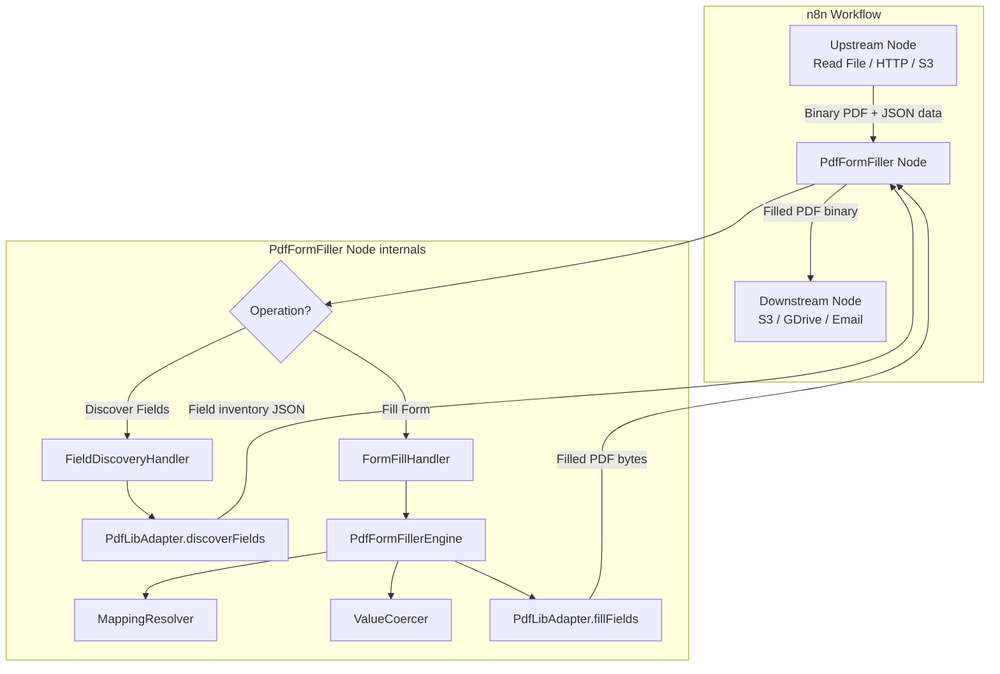
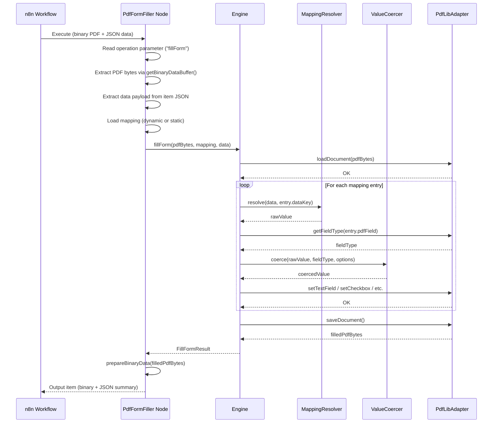
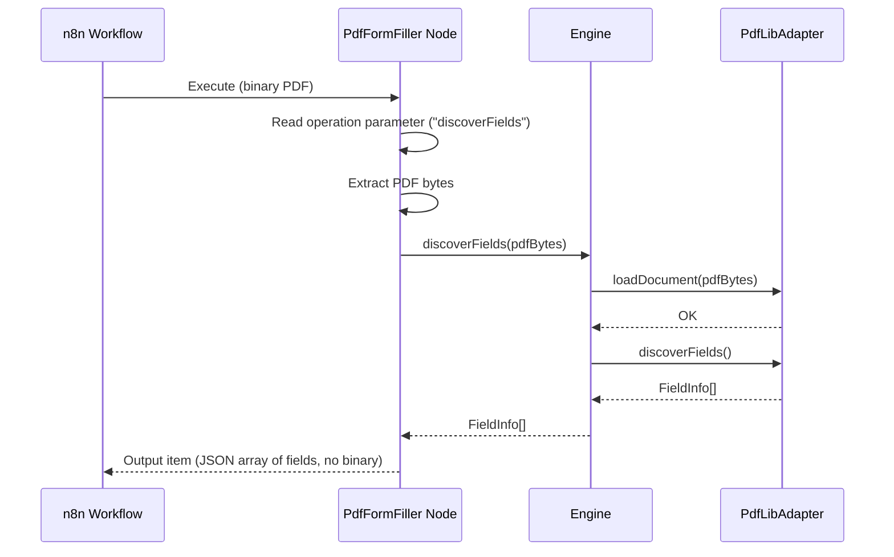

# 02 — Solution Architecture & Technical Design

**Project:** n8n PDF Form Filler Node
**Package name:** `n8n-nodes-pdf-form-filler`
**Version:** 1.0.0
**Date:** 2026-02-14

---

## 1. Architecture Overview

The solution is a self-contained n8n community node that fills AcroForm PDF fields using `pdf-lib`. It is structured as three layers:

```
┌─────────────────────────────────────────────────────────┐
│                   n8n Node Layer                        │
│  (PdfFormFiller.node.ts — implements INodeType)         │
│  Handles: UI definition, parameter collection,          │
│           binary I/O, n8n lifecycle                     │
├─────────────────────────────────────────────────────────┤
│                   Engine Layer                          │
│  (PdfFormFillerEngine.ts — pure TypeScript, no n8n)     │
│  Handles: Mapping resolution, type coercion,            │
│           fill orchestration, field discovery            │
├─────────────────────────────────────────────────────────┤
│                   pdf-lib Adapter                       │
│  (PdfLibAdapter.ts — wraps pdf-lib API)                 │
│  Handles: PDF load/save, field introspection,           │
│           value writing by field type                   │
└─────────────────────────────────────────────────────────┘
```

**Why three layers?**

- The **Node Layer** is tightly coupled to n8n's runtime (`IExecuteFunctions`, `INodeType`). It cannot be unit-tested without mocking the entire n8n environment.
- The **Engine Layer** is pure TypeScript with zero framework dependencies. All business logic lives here. It is fully unit-testable with plain Jest.
- The **pdf-lib Adapter** isolates the third-party library behind a clean interface. If `pdf-lib` is ever replaced (e.g. with LibPDF), only this layer changes.

---

## 2. Component Architecture



---

## 3. Project Structure

```
n8n-nodes-pdf-form-filler/
├── .github/
│   └── workflows/
│       └── ci.yml                    # GitHub Actions: lint, test, build
├── credentials/                      # (empty — no credentials needed)
├── nodes/
│   └── PdfFormFiller/
│       ├── PdfFormFiller.node.ts      # n8n node definition (INodeType)
│       ├── PdfFormFiller.node.json    # Node metadata (codex)
│       └── pdf-form-filler.svg       # Node icon
├── src/
│   ├── engine/
│   │   ├── PdfFormFillerEngine.ts     # Core orchestrator
│   │   ├── MappingResolver.ts         # Resolves dataKey → value via dot-notation
│   │   ├── ValueCoercer.ts            # Type coercion (bool→checkbox, date→string, etc.)
│   │   └── __tests__/
│   │       ├── PdfFormFillerEngine.test.ts
│   │       ├── MappingResolver.test.ts
│   │       └── ValueCoercer.test.ts
│   ├── adapter/
│   │   ├── PdfLibAdapter.ts           # pdf-lib wrapper
│   │   ├── FieldTypeDetector.ts       # Determines field type from pdf-lib field object
│   │   └── __tests__/
│   │       ├── PdfLibAdapter.test.ts
│   │       └── FieldTypeDetector.test.ts
│   ├── types/
│   │   ├── index.ts                   # All type exports
│   │   ├── FieldMapping.ts            # Mapping entry interface
│   │   ├── FieldInfo.ts               # Discovered field metadata
│   │   ├── FillResult.ts              # Per-field fill result
│   │   └── CoercionResult.ts          # Value coercion result
│   └── errors/
│       └── PdfFormFillerError.ts      # Custom error classes
├── test/
│   ├── fixtures/
│   │   ├── simple-text-form.pdf       # Minimal test PDF (text fields only)
│   │   ├── mixed-fields-form.pdf      # Text + checkbox + radio + dropdown
│   │   ├── ukpn-sample.pdf           # UKPN form (integration test)
│   │   └── sample-data.json           # Sample payloads
│   └── integration/
│       └── fillForm.integration.test.ts
├── package.json
├── tsconfig.json
├── tsconfig.build.json
├── eslint.config.mjs
├── jest.config.ts
├── .prettierrc.js
├── CHANGELOG.md
├── LICENSE.md
└── README.md
```

**Key conventions:**

| Directory | Purpose | Testability |
|---|---|---|
| `nodes/` | n8n-specific node definition. Thin wrapper only. | Integration tests via n8n dev mode |
| `src/engine/` | Framework-free business logic | Unit tests with Jest |
| `src/adapter/` | pdf-lib integration | Unit tests with real PDFs (fixtures) |
| `src/types/` | Shared TypeScript interfaces | N/A (type-only) |
| `test/fixtures/` | PDF files and sample data for tests | N/A (data) |

---

## 4. Data Flow

### 4.1 Discover Fields Operation

```
Input:  Binary PDF (from upstream n8n node)
        ↓
Step 1: PdfLibAdapter.loadDocument(pdfBytes)
        ↓
Step 2: PdfLibAdapter.discoverFields() → iterates form.getFields()
        ↓
Step 3: For each field:
        - Extract name, type (text/checkbox/radio/dropdown)
        - For dropdowns/radios: extract options
        - Collect page number if available
        ↓
Output: JSON array of FieldInfo objects on the n8n item
        (No binary output — this is a metadata-only operation)
```

**Output schema:**

```json
[
  {
    "name": "A1-First name",
    "type": "text",
    "required": false,
    "currentValue": "",
    "options": null,
    "page": null
  },
  {
    "name": "I-Phase 1",
    "type": "dropdown",
    "required": false,
    "currentValue": "",
    "options": ["Single", "Three"],
    "page": null
  },
  {
    "name": "C-B",
    "type": "checkbox",
    "required": false,
    "currentValue": false,
    "options": null,
    "page": null
  }
]
```

### 4.2 Fill Form Operation

```
Input:  Binary PDF (template)
        + JSON data payload (on the n8n item)
        + Field mapping (static node config OR dynamic JSON)
        ↓
Step 1: PdfLibAdapter.loadDocument(pdfBytes)
        ↓
Step 2: Engine loads mapping (dynamic first, static fallback)
        ↓
Step 3: For each mapping entry:
   3a:  MappingResolver.resolve(dataPayload, entry.dataKey) → raw value | undefined
   3b:  If undefined → record as "missing", continue
   3c:  ValueCoercer.coerce(rawValue, targetFieldType, entry) → coerced value
   3d:  PdfLibAdapter.setFieldValue(fieldName, coercedValue)
        ↓
Step 4: PdfLibAdapter.saveDocument() → Uint8Array
        ↓
Step 5: Node wraps bytes via this.helpers.prepareBinaryData()
        ↓
Output: Filled PDF binary + JSON summary (fields filled, warnings)
```

**Output JSON (alongside binary):**

```json
{
  "status": "success",
  "fieldsFilled": 42,
  "fieldsMissing": 3,
  "fieldsSkipped": 206,
  "warnings": [
    "Mapped field 'applicant.middleName' has no value in data payload"
  ],
  "fileName": "filled-form.pdf"
}
```

---

## 5. n8n Node Interface Design

### 5.1 Node Metadata

```typescript
// PdfFormFiller.node.ts
description: INodeTypeDescription = {
  displayName: 'PDF Form Filler',
  name: 'pdfFormFiller',
  icon: 'file:pdf-form-filler.svg',
  group: ['transform'],
  version: 1,
  subtitle: '={{ $parameter["operation"] }}',
  description: 'Fill AcroForm PDF fields with JSON data',
  defaults: {
    name: 'PDF Form Filler',
  },
  inputs: ['main'],
  outputs: ['main'],
  properties: [ /* see 5.2 */ ],
};
```

### 5.2 Node Parameters

| Parameter | Type | Display condition | Purpose |
|---|---|---|---|
| `operation` | options: `discoverFields`, `fillForm` | Always | Select operation |
| `binaryPropertyName` | string (default: `"data"`) | Always | Name of binary property containing the PDF template |
| `mappingSource` | options: `static`, `dynamic` | `fillForm` only | Where to read the field mapping from |
| `fieldMappings` | fixedCollection (repeatable) | `fillForm` + `mappingSource=static` | Manual mapping entries in the node UI |
| `fieldMappings.dataKey` | string | (child of fixedCollection) | Dot-notation path into the data payload |
| `fieldMappings.pdfField` | string | (child of fixedCollection) | Exact PDF field name |
| `fieldMappings.dateFormat` | string (default: `"DD/MM/YYYY"`) | (child of fixedCollection) | Optional date format override |
| `dynamicMappingProperty` | string (default: `"fieldMappings"`) | `fillForm` + `mappingSource=dynamic` | JSON property name on the input item containing the mapping array |
| `outputBinaryProperty` | string (default: `"data"`) | `fillForm` only | Name of binary property for the filled PDF output |
| `outputFileName` | string (default: `"filled-form.pdf"`) | `fillForm` only | Filename for the output binary |
| `warnOnMissingValues` | boolean (default: `true`) | `fillForm` only | Emit warnings for mapped fields with no data value |
| `defaultDateFormat` | string (default: `"DD/MM/YYYY"`) | `fillForm` only | Global default date format |

### 5.3 Node UI Wireframe

```
┌──────────────────────────────────────────────┐
│  📄 PDF Form Filler                          │
├──────────────────────────────────────────────┤
│  Operation:        [Fill Form         ▼]     │
│                                              │
│  PDF Binary Property: [data          ]       │
│                                              │
│  ── Mapping ──────────────────────────────── │
│  Mapping Source:   [Static (configure) ▼]    │
│                                              │
│  Field Mappings:                             │
│  ┌────────────────────────────────────────┐  │
│  │ Data Key:    [applicant.firstName   ]  │  │
│  │ PDF Field:   [A1-First name         ]  │  │
│  │ Date Format: [                      ]  │  │
│  ├────────────────────────────────────────┤  │
│  │ Data Key:    [isNewConnection       ]  │  │
│  │ PDF Field:   [C-B                   ]  │  │
│  │ Date Format: [                      ]  │  │
│  ├────────────────────────────────────────┤  │
│  │          [+ Add Mapping Entry]         │  │
│  └────────────────────────────────────────┘  │
│                                              │
│  ── Output ──────────────────────────────── │
│  Output Binary Property: [data       ]       │
│  Output File Name:       [filled.pdf ]       │
│                                              │
│  ── Options ─────────────────────────────── │
│  Warn on Missing Values: [✓]                 │
│  Default Date Format:    [DD/MM/YYYY ]       │
└──────────────────────────────────────────────┘
```

---

## 6. Core Engine Design

### 6.1 PdfFormFillerEngine

The engine is the central orchestrator. It is a pure TypeScript class with no n8n dependencies.

```typescript
// src/engine/PdfFormFillerEngine.ts

export class PdfFormFillerEngine {

  constructor(
    private adapter: IPdfAdapter,
    private options: EngineOptions = {},
  ) {}

  /**
   * Discover all form fields in the loaded PDF.
   */
  async discoverFields(pdfBytes: Uint8Array): Promise<FieldInfo[]>

  /**
   * Fill the PDF using a mapping and data payload.
   * Returns the filled PDF bytes and a summary.
   */
  async fillForm(
    pdfBytes: Uint8Array,
    mapping: FieldMappingEntry[],
    data: Record<string, unknown>,
  ): Promise<FillFormResult>
}
```

### 6.2 MappingResolver

Resolves dot-notation paths against a nested JSON object.

```typescript
// src/engine/MappingResolver.ts

export class MappingResolver {

  /**
   * Resolve a dot-notation key against a data object.
   * Returns undefined if any segment is missing.
   *
   * Examples:
   *   resolve({a: {b: 1}}, "a.b")     → 1
   *   resolve({a: {b: 1}}, "a.c")     → undefined
   *   resolve({a: {b: 1}}, "a.b.c")   → undefined
   *   resolve({x: [1,2]}, "x.0")      → 1
   */
  static resolve(data: Record<string, unknown>, path: string): unknown | undefined
}
```

### 6.3 ValueCoercer

Converts raw JavaScript values to the format expected by each PDF field type.

```typescript
// src/engine/ValueCoercer.ts

export class ValueCoercer {

  /**
   * Coerce a raw value into the format needed for a specific field type.
   *
   * Rules:
   *   Text fields:
   *     - Any value → String(value)
   *     - Date strings (ISO 8601) → formatted via dateFormat
   *     - null/undefined → "" (empty string)
   *
   *   Checkboxes:
   *     - true, "true", "yes", "1", 1 → check
   *     - false, "false", "no", "0", 0 → uncheck
   *     - Other → warning, skip
   *
   *   Radio groups:
   *     - String value must match one of the group's options (case-insensitive)
   *     - No match → warning, skip
   *
   *   Dropdowns:
   *     - String value must match one of the dropdown's options (case-insensitive)
   *     - No match → warning, skip
   */
  static coerce(
    value: unknown,
    targetType: PdfFieldType,
    options: CoercionOptions,
  ): CoercionResult
}
```

**Coercion decision matrix:**

| Raw value type | Target field type | Action | Result |
|---|---|---|---|
| `string` | text | Pass through (or format if ISO date detected + dateFormat set) | `setText(value)` |
| `number` | text | `String(number)` | `setText("42")` |
| `boolean` `true` | checkbox | Check | `check()` |
| `boolean` `false` | checkbox | Uncheck | `uncheck()` |
| `string` `"yes"` | checkbox | Check (case-insensitive) | `check()` |
| `string` `"Single"` | dropdown | Match against options (case-insensitive) | `select("Single")` |
| `string` `"single"` | dropdown | Match against options (case-insensitive) | `select("Single")` (uses original case from PDF) |
| `string` `"Choice1"` | radio | Match against options (case-insensitive) | `select("Choice1")` |
| `string` (no match) | dropdown/radio | Warning | Skip field |
| `null` / `undefined` | any | Treated as missing | Skip field |
| `"2025-06-15"` | text (with dateFormat) | Parse as ISO 8601, format | `setText("15/06/2025")` |

### 6.4 Date Handling

Dates are detected and formatted as follows:

1. The coercer checks if the raw value matches the ISO 8601 date pattern: `YYYY-MM-DD` or `YYYY-MM-DDTHH:mm:ss...`
2. If a `dateFormat` is specified (per-field or global default), the date is formatted accordingly.
3. If no `dateFormat` is specified and the value matches ISO 8601, it is still treated as a plain string (no transformation).
4. Formatting uses a lightweight built-in formatter (no `moment.js` or `date-fns` dependency).

**Supported format tokens:**

| Token | Meaning | Example |
|---|---|---|
| `DD` | Day (zero-padded) | `05` |
| `MM` | Month (zero-padded) | `06` |
| `YYYY` | Year (4-digit) | `2025` |
| `D` | Day (no padding) | `5` |
| `M` | Month (no padding) | `6` |
| `YY` | Year (2-digit) | `25` |

This covers the overwhelmingly common cases for form filling. If more complex formatting is needed in the future, it can be added without breaking changes.

---

## 7. pdf-lib Adapter

### 7.1 Interface

The adapter is defined against an interface so it can be mocked in engine tests.

```typescript
// src/adapter/PdfLibAdapter.ts

export interface IPdfAdapter {
  /** Load a PDF document from bytes. */
  loadDocument(pdfBytes: Uint8Array): Promise<void>;

  /** Discover all form fields. */
  discoverFields(): FieldInfo[];

  /** Get the type of a specific field. */
  getFieldType(fieldName: string): PdfFieldType | null;

  /** Get the available options for a radio/dropdown field. */
  getFieldOptions(fieldName: string): string[] | null;

  /** Set a text field value. */
  setTextField(fieldName: string, value: string): void;

  /** Check or uncheck a checkbox. */
  setCheckbox(fieldName: string, checked: boolean): void;

  /** Select a radio group option. */
  setRadioGroup(fieldName: string, optionValue: string): void;

  /** Select a dropdown option. */
  setDropdown(fieldName: string, optionValue: string): void;

  /** Save the document and return bytes. */
  saveDocument(): Promise<Uint8Array>;
}
```

### 7.2 Implementation Mapping

| Adapter method | pdf-lib API call |
|---|---|
| `loadDocument(bytes)` | `PDFDocument.load(bytes)` |
| `discoverFields()` | `form.getFields()` then classify via `instanceof` checks |
| `getFieldType(name)` | `form.getField(name)` → `instanceof PDFTextField` / `PDFCheckBox` / `PDFRadioGroup` / `PDFDropdown` |
| `setTextField(name, val)` | `form.getTextField(name).setText(val)` |
| `setCheckbox(name, true)` | `form.getCheckBox(name).check()` |
| `setCheckbox(name, false)` | `form.getCheckBox(name).uncheck()` |
| `setRadioGroup(name, val)` | `form.getRadioGroup(name).select(val)` |
| `setDropdown(name, val)` | `form.getDropdown(name).select(val)` |
| `saveDocument()` | `pdfDoc.save()` |

### 7.3 Field Type Detection

pdf-lib uses class-based field types. Detection via `instanceof`:

```typescript
import {
  PDFTextField,
  PDFCheckBox,
  PDFRadioGroup,
  PDFDropdown,
  PDFOptionList,
  PDFSignature,
  PDFButton,
} from 'pdf-lib';

function detectFieldType(field: PDFField): PdfFieldType {
  if (field instanceof PDFTextField)  return 'text';
  if (field instanceof PDFCheckBox)   return 'checkbox';
  if (field instanceof PDFRadioGroup) return 'radio';
  if (field instanceof PDFDropdown)   return 'dropdown';
  if (field instanceof PDFOptionList) return 'optionList';
  if (field instanceof PDFSignature)  return 'signature';
  if (field instanceof PDFButton)     return 'button';
  return 'unknown';
}
```

### 7.4 PDFDocument.load Options

```typescript
const pdfDoc = await PDFDocument.load(pdfBytes, {
  ignoreEncryption: true,    // Handle encrypted PDFs gracefully
  updateMetadata: false,     // Don't modify metadata
});
```

**Note on `ignoreEncryption`:** Some forms are distributed with owner-password encryption that restricts editing but not filling. `pdf-lib` can load these if `ignoreEncryption: true` is set. If the PDF has user-password encryption (requires password to open), the load will still fail — this is expected and we surface the error clearly.

---

## 8. Type Definitions

```typescript
// src/types/FieldMapping.ts

/** A single entry in the field mapping configuration. */
export interface FieldMappingEntry {
  /** Dot-notation path into the data payload. */
  dataKey: string;
  /** Exact PDF form field name. */
  pdfField: string;
  /** Optional date format override (e.g. "DD/MM/YYYY"). */
  dateFormat?: string;
}
```

```typescript
// src/types/FieldInfo.ts

/** Metadata about a discovered PDF form field. */
export interface FieldInfo {
  /** The field's full name in the PDF. */
  name: string;
  /** Detected field type. */
  type: PdfFieldType;
  /** Whether the field is marked as required in the PDF. */
  required: boolean;
  /** Current value (if any). */
  currentValue: string | boolean | null;
  /** Available options (for radio groups and dropdowns). */
  options: string[] | null;
  /** Read-only flag. */
  readOnly: boolean;
}

export type PdfFieldType =
  | 'text'
  | 'checkbox'
  | 'radio'
  | 'dropdown'
  | 'optionList'
  | 'signature'
  | 'button'
  | 'unknown';
```

```typescript
// src/types/FillResult.ts

/** Result of a single field fill attempt. */
export interface FieldFillResult {
  pdfField: string;
  dataKey: string;
  status: 'filled' | 'missing' | 'skipped' | 'error';
  message?: string;
}

/** Overall result of a fill operation. */
export interface FillFormResult {
  pdfBytes: Uint8Array;
  status: 'success' | 'partial' | 'error';
  fieldsFilled: number;
  fieldsMissing: number;
  fieldsSkipped: number;
  fieldsErrored: number;
  warnings: string[];
  details: FieldFillResult[];
}
```

```typescript
// src/types/CoercionResult.ts

export interface CoercionResult {
  success: boolean;
  value?: string | boolean;
  warning?: string;
}

export interface CoercionOptions {
  dateFormat?: string;
  fieldOptions?: string[];   // Available options for radio/dropdown
}
```

```typescript
// src/engine/PdfFormFillerEngine.ts (options)

export interface EngineOptions {
  warnOnMissingValues?: boolean;  // default: true
  defaultDateFormat?: string;     // default: "DD/MM/YYYY"
}
```

---

## 9. Error Handling Strategy

### 9.1 Error Classification

| Error class | When | User-facing message | Behaviour |
|---|---|---|---|
| `PdfLoadError` | PDF bytes are invalid, corrupted, or password-protected | "Failed to load PDF: [detail]" | Abort — no output |
| `NoFormError` | PDF has no AcroForm data | "This PDF does not contain any form fields (AcroForm). XFA forms are not supported." | Abort — no output |
| `InvalidMappingError` | Mapping JSON is malformed or missing required fields | "Invalid field mapping: [detail]" | Abort — no output |
| `FieldNotFoundError` | Mapping references a `pdfField` that doesn't exist in the PDF | Warning (not a hard error) | Skip field, add to warnings |
| `CoercionError` | Value cannot be coerced to target type (e.g. "banana" for a checkbox) | Warning: "Cannot coerce value for field [name]" | Skip field, add to warnings |
| `OptionMismatchError` | Radio/dropdown value doesn't match any available option | Warning: "Value '[val]' not in options for [name]" | Skip field, add to warnings |

### 9.2 Error Handling Philosophy

**Hard errors** (abort execution): Problems with inputs that make the operation fundamentally impossible — bad PDF, bad mapping structure. These throw `NodeOperationError` in the node layer.

**Soft errors** (warning + continue): Per-field problems that don't prevent other fields from being filled. These are collected as warnings in the `FillFormResult`. The operation completes with `status: 'partial'` if any soft errors occurred.

### 9.3 n8n Error Integration

```typescript
// In PdfFormFiller.node.ts
import { NodeOperationError } from 'n8n-workflow';

try {
  const result = await engine.fillForm(pdfBytes, mapping, data);
  // return result...
} catch (error) {
  if (error instanceof PdfLoadError) {
    throw new NodeOperationError(this.getNode(), error.message, {
      description: 'Check that the input is a valid AcroForm PDF.',
    });
  }
  // etc.
}
```

---

## 10. Testing Strategy

### 10.1 Test Pyramid

```
                    ┌──────────┐
                    │ E2E (1)  │  Manual: fill UKPN form, open in Adobe Reader
                   ┌┴──────────┴┐
                   │Integration  │  Real PDFs + engine + adapter (3-5 tests)
                  ┌┴────────────┴┐
                  │  Unit Tests   │  Engine, Resolver, Coercer, Adapter (30+ tests)
                  └──────────────┘
```

### 10.2 Unit Tests (Jest)

**MappingResolver:**
- Resolves simple path (`"firstName"` → `data.firstName`)
- Resolves nested path (`"a.b.c"` → `data.a.b.c`)
- Returns `undefined` for missing path
- Handles array indices (`"items.0.name"`)
- Handles empty string key, null data, undefined data

**ValueCoercer:**
- String → text (pass-through)
- Number → text (stringified)
- `true` → checkbox checked
- `false` → checkbox unchecked
- `"yes"` → checkbox checked (case-insensitive)
- `"no"` → checkbox unchecked (case-insensitive)
- Valid option → dropdown select (case-insensitive matching, original case preserved)
- Invalid option → warning
- ISO date + format → formatted string
- ISO date without format → pass-through as string
- `null` → missing
- `undefined` → missing
- Non-boolean for checkbox → warning

**PdfFormFillerEngine:**
- Fill with complete mapping + data → all fields filled
- Fill with partial data → filled + missing counts correct
- Fill with unknown pdfField → warning
- Fill with empty mapping → zero fields filled, no errors
- Discover fields on a valid form → correct inventory
- Discover fields on a formless PDF → NoFormError

**PdfLibAdapter:**
- Load valid PDF → success
- Load invalid bytes → PdfLoadError
- Discover fields → correct types and names
- Set text field → value readable after save
- Set checkbox → state correct after save
- Set dropdown → selection correct after save
- Set radio group → selection correct after save

### 10.3 Integration Tests

- **Round-trip test:** Load fixture PDF → fill via engine → save → reload → verify all values
- **UKPN form test:** Load UKPN form → fill 20+ representative fields across all types → save → reload → verify
- **Edge cases:** Empty form, form with read-only fields, form with pre-filled values

### 10.4 Test Fixtures

Test PDFs will be created programmatically using pdf-lib during test setup, except for the UKPN form (which is a real-world fixture). This avoids checking large binaries into the repository.

```typescript
// test/fixtures/createTestPdf.ts
async function createMixedFieldsForm(): Promise<Uint8Array> {
  const pdfDoc = await PDFDocument.create();
  const page = pdfDoc.addPage();
  const form = pdfDoc.getForm();

  form.createTextField('name').addToPage(page, { x: 50, y: 700 });
  form.createTextField('email').addToPage(page, { x: 50, y: 650 });

  const cb = form.createCheckBox('agree');
  cb.addToPage(page, { x: 50, y: 600 });

  const radio = form.createRadioGroup('colour');
  radio.addOptionToPage('Red', page, { x: 50, y: 550 });
  radio.addOptionToPage('Blue', page, { x: 50, y: 500 });

  const dropdown = form.createDropdown('country');
  dropdown.addOptions(['UK', 'US', 'DE']);
  dropdown.addToPage(page, { x: 50, y: 450 });

  return pdfDoc.save();
}
```

---

## 11. Build & Packaging

### 11.1 package.json (key fields)

```json
{
  "name": "n8n-nodes-pdf-form-filler",
  "version": "1.0.0",
  "description": "n8n node to fill AcroForm PDF fields with JSON data",
  "keywords": [
    "n8n-community-node-package",
    "n8n-nodes",
    "pdf",
    "form",
    "acroform",
    "fill"
  ],
  "main": "dist/nodes/PdfFormFiller/PdfFormFiller.node.js",
  "files": [
    "dist/"
  ],
  "n8n": {
    "n8nNodesApiVersion": 1,
    "nodes": [
      "dist/nodes/PdfFormFiller/PdfFormFiller.node.js"
    ]
  },
  "scripts": {
    "build": "n8n-node build",
    "dev": "n8n-node dev",
    "lint": "n8n-node lint",
    "lint:fix": "n8n-node lint --fix",
    "test": "jest",
    "test:watch": "jest --watch",
    "test:coverage": "jest --coverage",
    "prepublishOnly": "npm run build && npm run lint && npm run test"
  },
  "dependencies": {
    "pdf-lib": "^1.17.1"
  },
  "devDependencies": {
    "@n8n/node-cli": "*",
    "n8n-workflow": "*",
    "@types/jest": "^29.x",
    "jest": "^29.x",
    "ts-jest": "^29.x",
    "typescript": "^5.x"
  },
  "engines": {
    "node": ">=22.0.0"
  }
}
```

### 11.2 TypeScript Configuration

```json
// tsconfig.json
{
  "compilerOptions": {
    "module": "CommonJS",
    "target": "ES2022",
    "lib": ["ES2022"],
    "outDir": "./dist",
    "rootDir": "./",
    "strict": true,
    "esModuleInterop": true,
    "resolveJsonModule": true,
    "declaration": true,
    "declarationMap": true,
    "sourceMap": true,
    "skipLibCheck": true
  },
  "include": [
    "nodes/**/*.ts",
    "src/**/*.ts"
  ],
  "exclude": [
    "node_modules",
    "dist",
    "test",
    "**/__tests__/**"
  ]
}
```

### 11.3 Jest Configuration

```typescript
// jest.config.ts
export default {
  preset: 'ts-jest',
  testEnvironment: 'node',
  roots: ['<rootDir>/src', '<rootDir>/test'],
  testMatch: ['**/__tests__/**/*.test.ts', '**/test/**/*.test.ts'],
  collectCoverageFrom: [
    'src/**/*.ts',
    '!src/types/**',
    '!src/**/__tests__/**',
  ],
  coverageThresholds: {
    global: {
      branches: 80,
      functions: 80,
      lines: 80,
      statements: 80,
    },
  },
};
```

---

## 12. Dependency Inventory

### 12.1 Runtime Dependencies

| Package | Version | Purpose | Size | Native? |
|---|---|---|---|---|
| `pdf-lib` | ^1.17.1 | PDF form introspection and filling | ~370 KB (minified) | No — pure JS |

**Total runtime dependencies: 1**

`pdf-lib` has zero transitive dependencies of its own (it bundles its own PDF parser). This is ideal for an n8n node.

### 12.2 Development Dependencies

| Package | Purpose |
|---|---|
| `@n8n/node-cli` | n8n node build tooling, dev mode, linting |
| `n8n-workflow` | Type definitions (`INodeType`, `IExecuteFunctions`, etc.) |
| `typescript` | TypeScript compiler |
| `jest` | Test runner |
| `ts-jest` | Jest transformer for TypeScript |
| `@types/jest` | Jest type definitions |

---

## 13. Sequence Diagrams

### 13.1 Fill Form — Happy Path



### 13.2 Discover Fields



---

## 14. Resolved Design Questions

| # | Question | Decision | Rationale |
|---|---|---|---|
| 1 | Support `PDFOptionList` (multi-select) in v1? | **Yes** — include it. Same API pattern as dropdown. | Low effort, avoids surprising gaps. |
| 2 | How to handle auto-generated radio option names? | **Exact match required.** Discover Fields exposes option names; workflow builder maps accordingly. | Keep engine simple. Documentation responsibility. |
| 3 | Embed custom fonts for non-Latin text? | **No in v1.** Document the Helvetica limitation. Surface clear error. | Complex feature; defer to v2 if demand exists. |
| 4 | Discover Fields binary pass-through? | **Yes** — pass original PDF binary through unchanged alongside the JSON inventory. | Enables Discover → Fill chaining without extra Read File node. |

---

## 15. Risk Register

| Risk | Likelihood | Impact | Mitigation |
|---|---|---|---|
| **pdf-lib cannot handle a specific PDF** (encryption, corruption, non-standard AcroForm) | Medium | High — fill fails entirely | Wrap in try/catch with clear error message. Document known limitations. Test against multiple real-world PDFs including UKPN form. |
| **Checkbox/radio field names in the PDF don't match what pdf-lib reports** | Low | Medium — wrong fields filled | Discover Fields operation lets users inspect actual field names before building mappings. |
| **pdf-lib is unmaintained** (last release: 2021) | Medium | Low (short-term), Medium (long-term) | Library is stable and feature-complete for AcroForm filling. LibPDF exists as a drop-in alternative if needed. The adapter layer isolates pdf-lib from the rest of the codebase. |
| **n8n node API changes** | Low | Medium — breaking changes to node interface | Pin `n8n-workflow` to a specific major version. Follow n8n's migration guides. |
| **Non-Latin characters cause font errors** | Medium | Medium — text fields fail for non-Latin content | Document limitation in v1. Plan font embedding for v2 if demand exists. |

---

## 16. Document History

| Version | Date | Author | Change |
|---|---|---|---|
| 1.0 | 2026-02-14 | Claude + User | Initial architecture |
